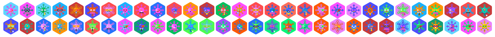

Hydro-Snowflake-Identicon-Generator Based On  Blockies
=======================================================

A tiny library for generating unique snowflake identicons for hydro snowflake addresses. These are not meant to replace user profiles, but as security icons, to allow the user to more easily check if an address he wants to interact with is the correct one. The symmetrical aspect of the icons allow our brain see [faces or objects](https://en.wikipedia.org/wiki/Pareidolia), making the icon more recognizable.



Use
---

```javascript
var icon = hydroIdenticon.create({ // All options are optional
    seed: 'randstring', // seed used to generate icon data, default: random
    size: 50, // width/height of the icon in pixels, default: 125
});

document.body.appendChild(icon); // icon is a canvas element
```

In the above example the icon will be 50x50 pixels.


Notes
-----

The defaults of size 125 generates 125x125 pixel icons. Below are some standard sizes that work well.

 * 24x24 `{size: 24}`
 * 50x50 `{size: 50}`

License
-------

[WTFPL](http://www.wtfpl.net/)
